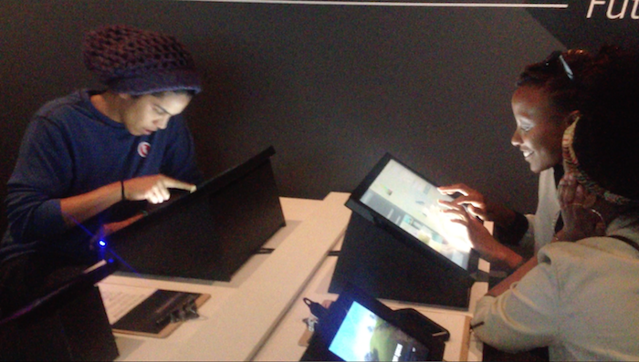
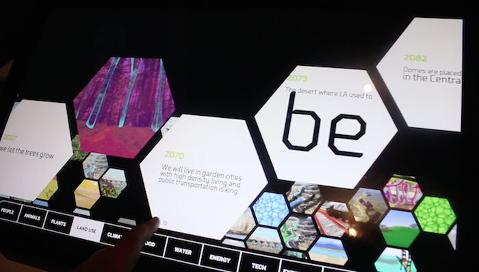
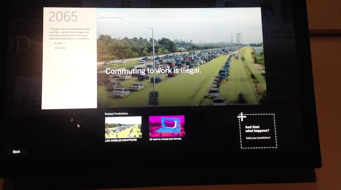
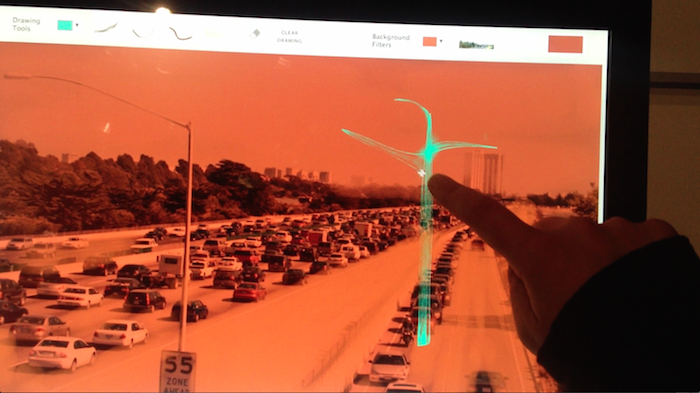
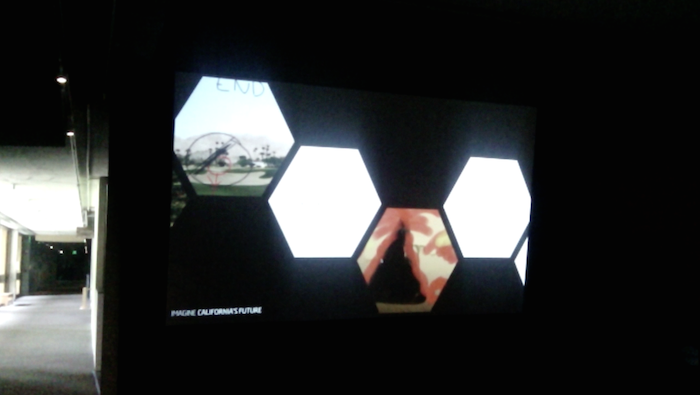

Collabortive drawing + storytelling project about California's future, created for the Oakland Museum of California's Natural Science Gallery. A space for reflection and conversation about the impacts of humans on the environment, global shifts and possibilities both dire and hopeful.

The experience consists of two primary components: a large-scale, immersive visualization as well as several “input stations” where visitors can build off of previous ideas, as well as add their own.

<iframe class="vid" src="//player.vimeo.com/video/112487926?title=0&amp;byline=0&amp;portrait=0&amp;color=ffffff&amp;autoplay=0&amp;loop=1" width="700" height="393" frameborder="0" webkitallowfullscreen mozallowfullscreen allowfullscreen></iframe>

The installation is built using NodeJS, websockets, a MongoDB database, and node-webkit.

Software Development and Interface Design: Olivia Jack  
Graphic Identity: Joe Bromley, Auburn Lahoski  
Initial Concept: Don Pohlman  
Prototyping: Melissa Standen  
