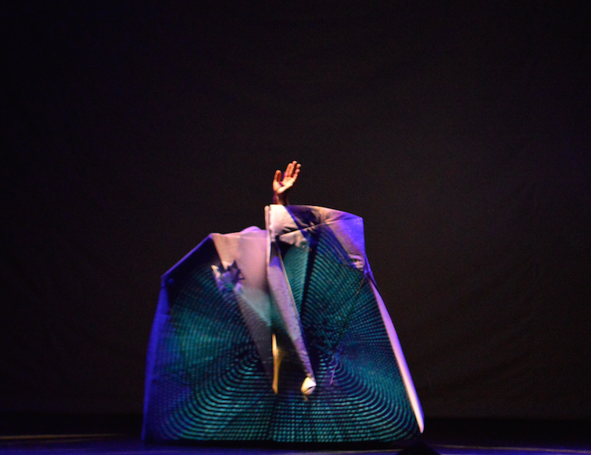
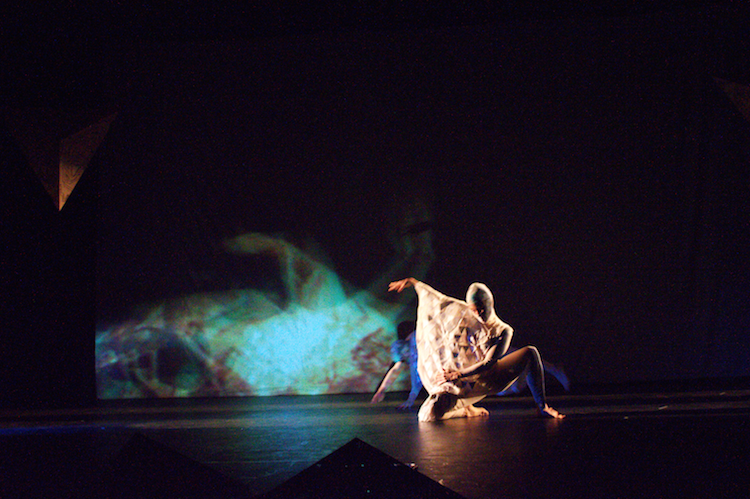
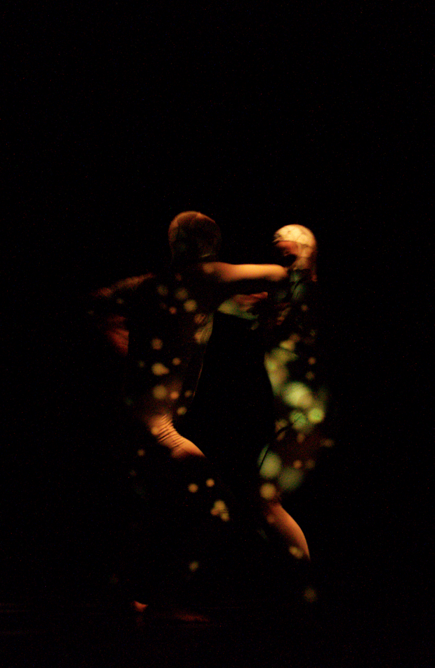

<iframe src="https://player.vimeo.com/video/304017065?title=0&amp;byline=0&amp;portrait=0&amp;color=ffffff&amp;autoplay=1&amp;loop=1" width="700" height="400" frameborder="0" webkitallowfullscreen mozallowfullscreen allowfullscreen></iframe>

Interactive projection mapping using custom software for the experimental dance performance, NODOS, cuerpos en expansión. Dir: Edna Orozco, November 2015.

Proyecto ganador de la Beca de creación-investigación en Danza y tecnología del Ministerio de Cultura 2015

En cada relación con el entorno, hay un despliegue de rastros invisibles, de nodos de información, que se articulan dando paso a la aparición de un nuevo cuerpo que se expande y se contrae; que se fusiona con otros cuerpos, máquinas o información de otros nodos...

 Dirección, concepción y producción general: Edna Orozco
 Bailarines: Sara Fonseca, Yehison Rodríguez y Juan Camilo Herrera
 Escenografía, diseño gráfico y asesoría coreográfica: Fabio Romero Sterns
 Diseño y confección de Vestuario: Ricardo Roldán
 Programación y proyecciones interactivas: Olivia Jack
 Composición musical: Guillaume Cros
 Diseño sonoro: Andrés Torres
 Luminotecnia: Claudia Tobón
 Arte interactivo: Juan Felipe Cristancho, Eleven Producciones
 Animación 3D para video Mapping: Luis Alfonso
 Diseño de personaje virtual: Aristóbulo Romero

