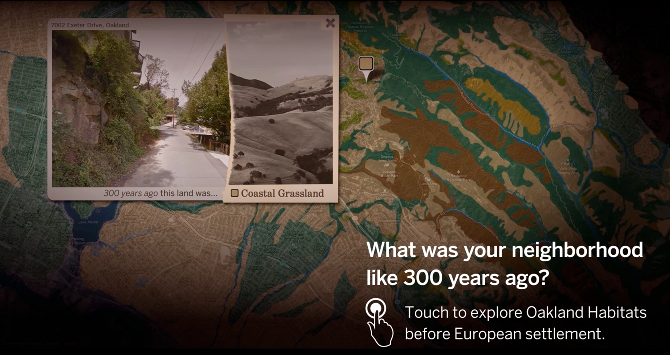
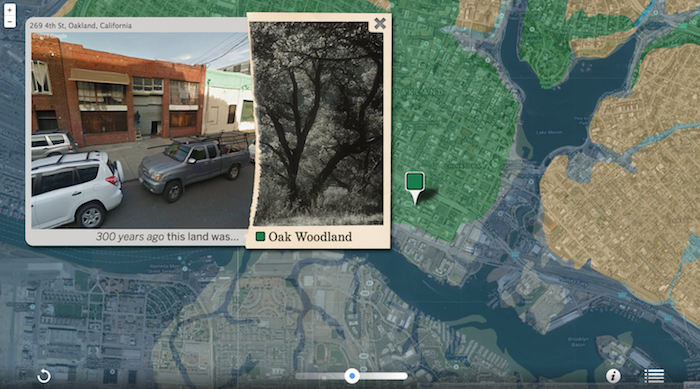
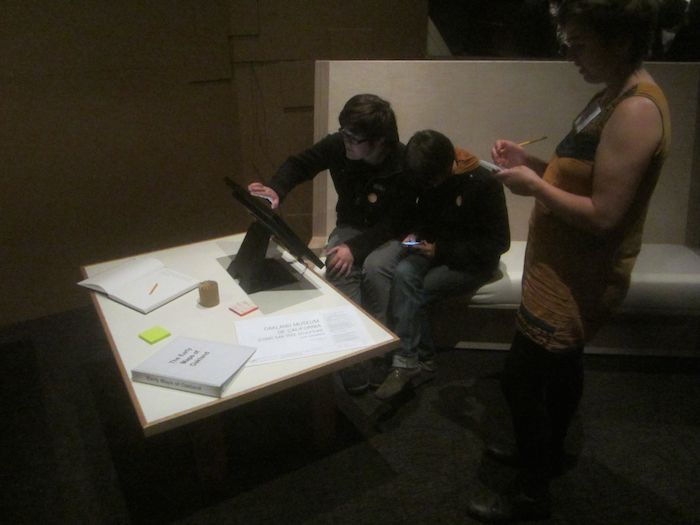

OAKLAND THEN AND NOW: photo & map-based exploration of past and present habitats, created for the Natural Sciences gallery at Oakland Museum of California.

<iframe src="//player.vimeo.com/video/116558796?title=0&amp;byline=0&amp;portrait=0&amp;color=ffffff&amp;autoplay=1&amp;loop=1" width="700" height="393" frameborder="0" webkitallowfullscreen mozallowfullscreen allowfullscreen></iframe>
 
Located in the "Nature in Oakland" section of the Sciences gallery, this interactive experience connects scientific information about Oakland vegetation with real places that are familiar to the vistor. The map is based off of historical ecology data provided by ecologist Todd Keeler-Wolf.

Visitors to the museum can touch a point on a modern map of Oakland and see their house, school, or favorite park juxtaposed with images of what that place used to look like. The photo-based nature of the experience connects to things that people intuitively know about what they see in their neighborhood: we are not simply told that a particular swath of land used to be ‘Coastal Grassland’, but can see visual similarities between patches of grass still in the neighborhood and the grassland that used to be there.

Working on this project as a developer and cartographer has been an iterative process to figure out how to best use technology to create an accessible and responsive interface, and how to move beyond a map with abstract color blocks into something more relatable and intuitive to human beings.

Interface Design and Development: Olivia Jack
 Graphic Design: Joe Bromley
 Oakland Museum of California, Natural Sciences Gallery

Created using Javascript, Leaflet, and Google Maps Street View service.

[prototyping in the gallery]

<!---The experience is a visual foray into the legacy of European colonization and 300 years of development.-->
