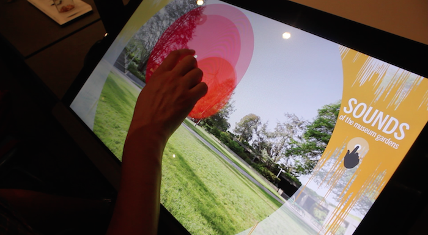
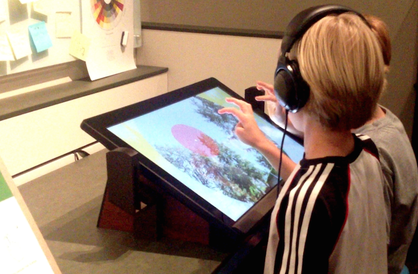
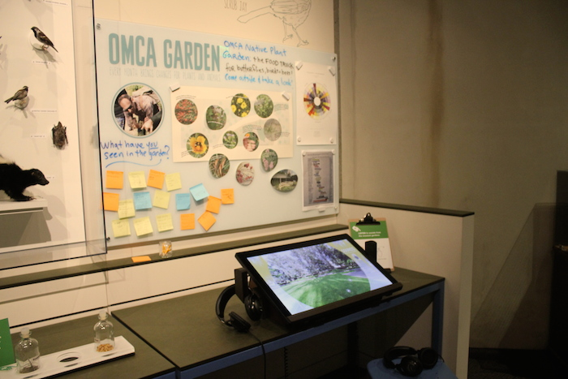
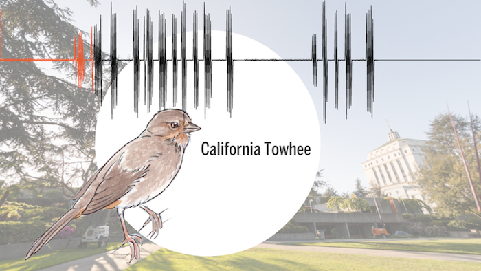

Interactive exploration of sounds found in the gardens of the Oakland Museum.

<iframe src="//player.vimeo.com/video/113040714?title=0&amp;byline=0&amp;portrait=0&amp;color=ffffff&amp;autoplay=1&amp;loop=1" width="700" height="393" frameborder="0" webkitallowfullscreen mozallowfullscreen allowfullscreen></iframe>
 
 
 
Sounds of each animal are represented by colorful, dynamic dots that change appearance according to pitch and intensity. Sounds are located in 3d space, so that shifting perspective changes both the imagery and the perceived locations of the different sounds. By touching a sound dot, the viewer can isolate that sound and discover which animal makes each noise. 
 
 

Concept, design, and development: Olivia Jack
 Sound editing: Tana Sprague
 Sounds from the Oakland Museum of California Library of natural sounds
 Created using Flash Actionscript 3.0 and Away3D

