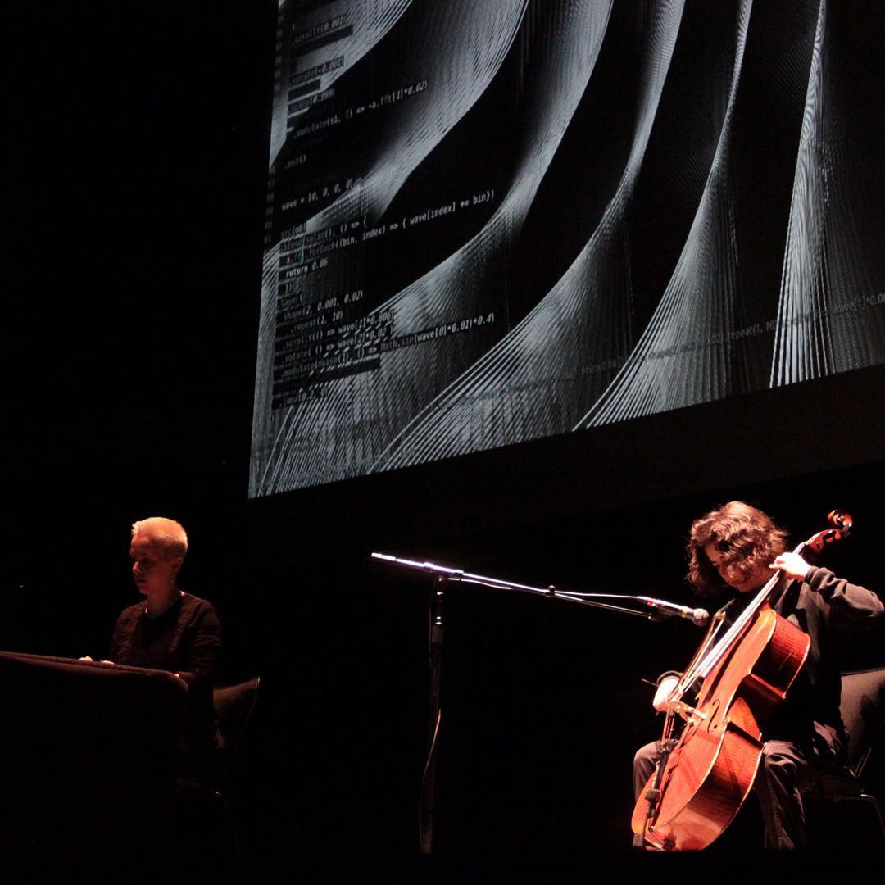

+++
title = "tu lengua y la mía"
date = "2019-07-17"
image = "tu-lengua.jpg"
tags = ['live-coding', 'performance', 'visuals', 'hydra']
categories = ['performances']
draft = false
layout = "posts"
+++

with Mabe Fratti. computer, cello + synths
Teatro de las Artes CENART, Mexico City, Mexico (2019)



Un encuentro entre Mabe Fratti, Olivia Jack, un cello y un ordenador. Nodos independientes que en su propio recorrido se encuentran. Inspirada en el orden que surge del caos, en una teoría llamada Arnold's Tongue, la pieza de Fratti y Jack contará una historia que trata de asimilar el movimiento de la aleatoriedad que se encuentra eventualmente en puntos de balance: en la desarmonía, la eventual armonía. En lo confuso, lo comprensible. En la glosolalia, un lenguaje.



<!--  -->