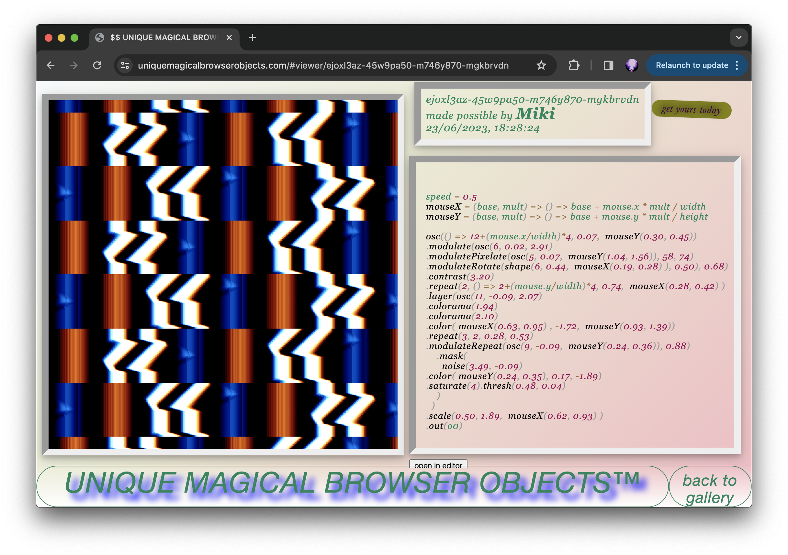
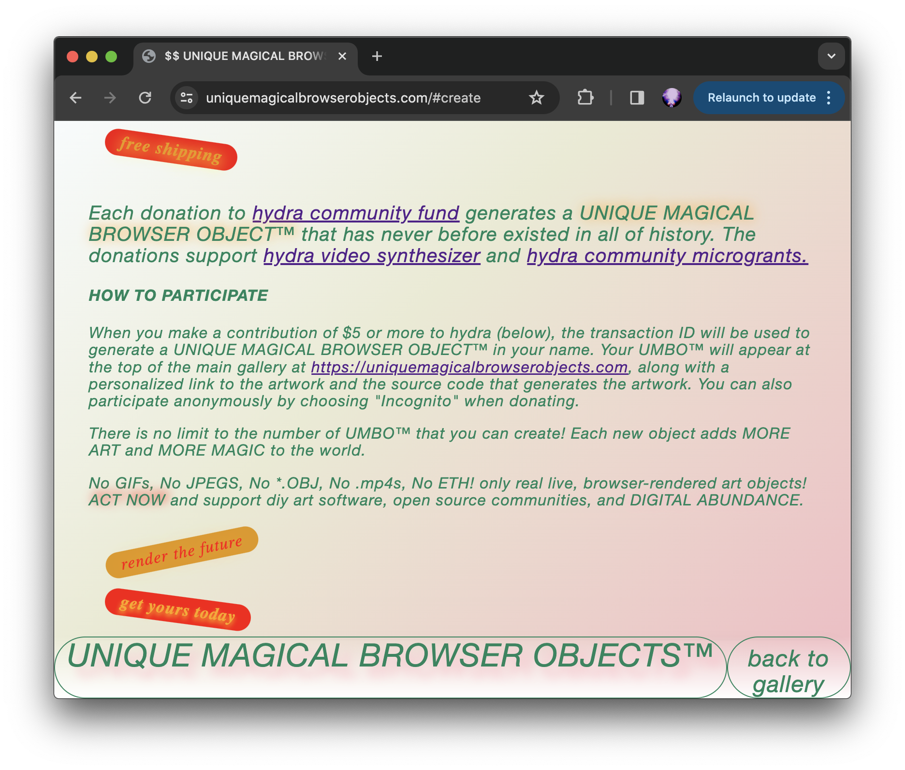

<!-- # uniquemagicalbrowserobjects.com -->

https://uniquemagicalbrowserobjects.com

Web gallery of generative code sketches. A hydra sketch is  auto-generated for each donation to hydra video synth. The website showcases each generative sketch as well as the code to create the sketch. Donations support hydra community microgrants https://hydra.ojack.xyz/grants/ . Made with javascript + hydra

some sketches auto-generated by the algorithm:





