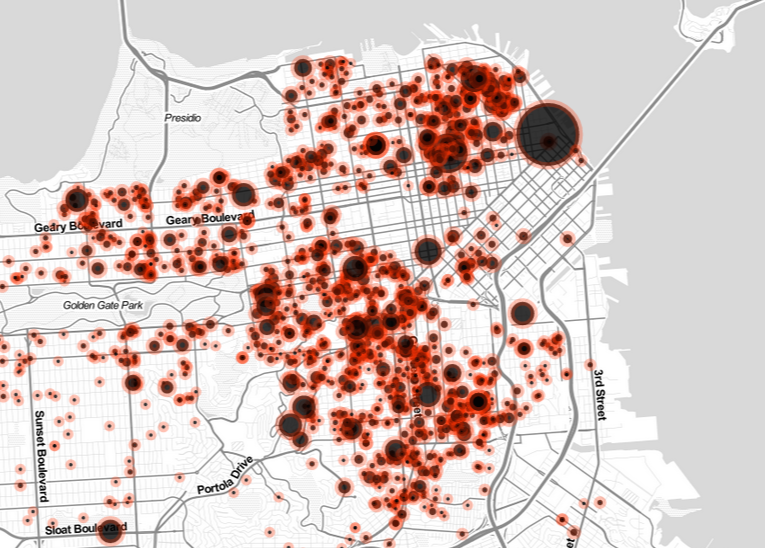

Created [a series of maps](http://www.antievictionmappingproject.net/ellis.html) as part of the Anti-Eviction Mapping Project, a data-visualization and digital storytelling collective working to document the housing crisis in San Francisco, California.

Animated map of Ellis Act Evictions in San Francisco, 2007-2011.

<h1> About </h1>
Each individual dot on these maps is a building in which all of the residents were evicted through no fault of their own. The size of the dots corresponds to the number of units in each building, and the map is animated to show the cumulation of these evictions over time.

The data used in these maps comes from the SF Rent Board and the SF Planning Commission. Maps showing housing data are nothing new, and have frequently been created by real estate companies and the assessors office to provide information to home buyers and landlords. These real estate maps are created with the very specific purposes of expediting the process of buyng and selling houses, in other words of displaying the economic rather than the human side of the housing market.  

As a collective of activists and techworkers, the Anti-Eviction Mapping Project is interested in exploring and exposing the power relationships underpinning housing changes in the Bay Area. Some driving questions in this project have been:
*	What would a map of housing data created from the perspective of tenants, rather than home-buyers, look like?  
*	In what ways is data perceived as "objective", while actually reinforcing existing hierarchies of power and points of view?
*	How can a visualization evoke a more human realtionship to the data it represents?

Map of all [No-Fault Evictions](http://www.antievictionmappingproject.net/combined.html) in San Francisco, 2007-2011.

Design & development: Olivia Jack
  Concept and data gathering: Anti-Eviction Mapping Project

Created using d3.js, Leaflet, and CartoDB.
[Code on Github](https://github.com/ojack/Anti-Eviction-Mapping-Project).

## Press
*	<a href="http://www.theatlanticcities.com/housing/2013/10/startling-animation-15-years-evictions-san-francisco/7260/" target="_blank">Atlantic Cities</a>
* [Curbed SF](http://sf.curbed.com/archives/2013/10/17/animated_ellis_act_map_shows_explosive_effects_of_evictions.php)
*	[SF Bay Guardian](http://www.sfbg.com/politics/2013/10/15/watch-depressing-time-lapse-visualization-ellis-act-evictions)
*	[SF Street Sheet](https://www.facebook.com/photo.php?fbid=765058260187124&set=a.675753815784236.1073741826.672794612746823&type=1&theater)
* 	[The Bold Italic](http://www.thebolditalic.com/articles/3821-map-time-sfs-eviction-explosion)
*	<a href="http://googlemapsmania.blogspot.com/2013/10/mapping-ellis-act-evictions-in-san.html" target="_blank">Google Maps Mania</a>
*	<a href="http://www.sfexaminer.com/sanfrancisco/time-lapse-map-shows-ellis-act-impacts/Content?oid=2604754" target="_blank">SF Examiner</a>
*	<a href="http://seethroughmaps.wordpress.com/" target="_blank">See Through Maps Exhibition</a>, Global Urban Humanities Initiative and Berkeley Center for New Media
*	[Pando Daily](http://pando.com/2014/03/03/erin-mcelroy-reveals-whats-next-for-the-sf-anti-eviction-mapping-project/)
*  [The Bold Italic](http://www.thebolditalic.com/articles/4092-new-maps-eviction-explosion-and-ellis-acting-seniors)
* [Capital and Main](http://www.laane.org/capitalandmain/amp-ing-up-the-fight-against-evictions/)
* [Model View Culture](https://modelviewculture.com/pieces/tech-workers-and-the-eviction-crisis)

Al Jazeera+ made a video using the map:
<iframe width="700" height="393" src="//www.youtube.com/embed/D3UPom9R04U" frameborder="0" allowfullscreen></iframe>

<!---The goal of this project is to explore the c

	-explore the ever-changing

	 Each individual dot on this map is a building in which all of the residents were evicted through no fault of their own. The size of the dots correspond to the number of units in each building, and the map is animated to show the cumulation of these evictions over time.

	The data used in these maps comes from the San Francisco Rent Board and the San Francisco Planning commission. Maps showing housing data are nothing new, and have frequently been created by real estate companies to help home buyers and landlords. These real estate maps are created with the very specific purposes of expediting economic transactions, of displaying the monetary rather than the human side of the housing market.  

	As a collective of activists and techworkers, the Anti-Eviction Mapping Project is interested in exploring and exposing the power relationships underpinning the housing market in the Bay Area.
	What would a map of housing data from the perspective of tenants, rather than home-buyers, look like?  
	In what ways is data perceived as "objective", while actually reinforcing existing hierarchies of power and points of view?
	How can a visualization evoke a more human realtionship to the data it represents?

	Design & development: Olivia Jack
	Concept and data gathering: Anti-Eviction Mapping Project
	Created using d3.js, Leaflet, and CartoDB.

	buyers and sellers in theData about the housing market is collected by the assesors office and real estate companies in order to expedite these economic transactions.

	Most maps of housing data are created by real estate companies, for the purpose of helping people decide which houses to buy. These maps focus on the economic value of each of these transactions, and the resulting geographic territory is displayed as blocks of color [in an economic landscape]. Data about the housing market is collected by the assesors office and real estate companies in order to expedite these economic transactions. The goal of these maps is to obscure the human underpinnings of each of these transactions.

	This is a data visualization of housing data in San Francisco, and it is also a map of loss, of an epidemic .. Each individual dot is a building in which every unit was forced to leave The data is not aggregated into any sort of
	THis series of maps documents the loss that San Francisco is facing as long-time residents are forced to look for housing elsewhere.

	As someone who has lived my entire life in San Frac

    A driving question in beginning to
	As someone born in San Francisco working in technology, can see that the city is changing rapidly as housing prices ...

	 Most maps of housing data are created by real estate companies, for the purpose of helping people cecide which houses to buy. These maps focus on the economic value of each of these transactions, and the re

	 How can data evoke a more human relationship ....

	 although the data used in this map is supposedly public data

	Part of the process of creating this map was exploring, what would a map from the perspective of tenants look like?  

	//How can activists and tech workers come together to work to create a San Francisco that supports the needs of long-time residensts.
-->
