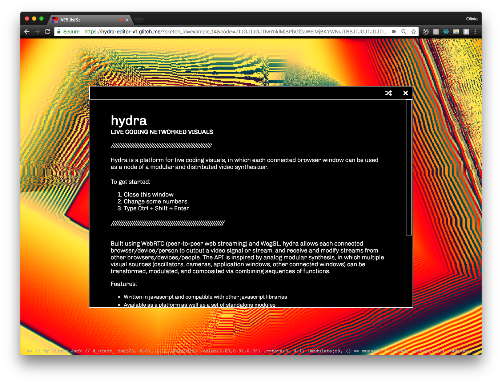
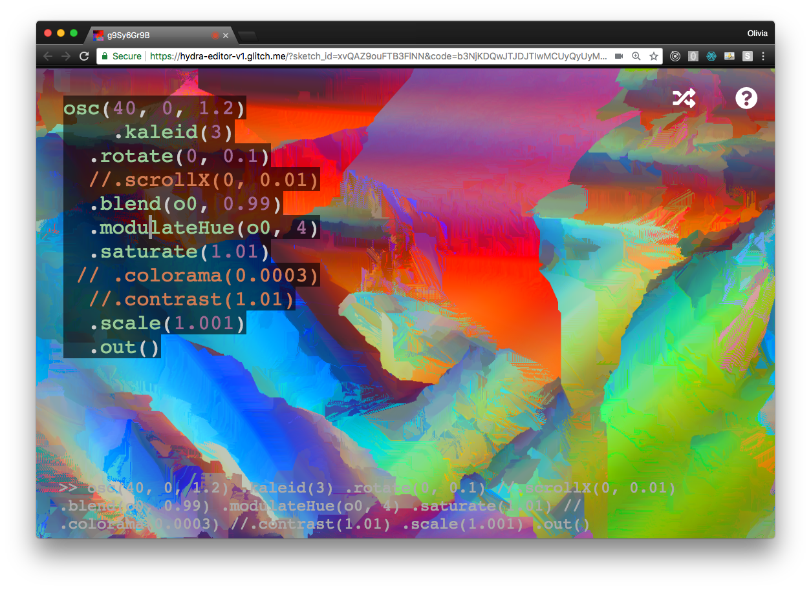

Ongoing investigation into the aesthetics of distributed networks, feedback, collaboration, and chaos in live performance/on the internet. [Hydra](https://hydra.ojack.xyz) is a browser-based platform for live coding visuals

Built using WebRTC (peer-to-peer web streaming) and WegGL, hydra allows each connected browser/device/person to output a video signal or stream, and receive and modify streams from other browsers/devices/people. The API is inspired by analog modular synthesis, in which multiple visual sources (oscillators, cameras, application windows, other connected windows) can be transformed, modulated, and composited via combining sequences of functions.


### More:

*	[A free, shared visual playground in the browser: Olivia Jack talks Hydra](http://cdm.link/2019/02/hydra-olivia-jack/)

 

<video width="700" height="450" autoplay loop>
  <source src="times-square.mp4" type="video/mp4">
Your browser does not support the video tag.
</video> 
Live stream of times square + live stream of an aquarium, live-coded in hydra
 
 
 
<iframe
  height = 400
  width=700
  frameBorder="0"
  src="https://hydra.ojack.xyz/?show-code=false&sketch_id=example_14&code=JTJGJTJGJTIwYnklMjBPbGl2aWElMjBKYWNrJTBBJTJGJTJGJTIwJTQwX29qYWNrXyUwQSUwQW9zYygyMCUyQyUyMDAuMDElMkMlMjAxLjEpJTBBJTA5LmthbGVpZCg1KSUwQSUwOS5jb2xvcigyLjgzJTJDMC45MSUyQzAuMzkpJTBBJTA5LnJvdGF0ZSgwJTJDJTIwMC4xKSUwQSUwOS5tb2R1bGF0ZShvMCUyQyUyMCgpJTIwJTNEJTNFJTIwbW91c2UueCUyMColMjAwLjAwMDMpJTBBJTA5LnNjYWxlKDEuMDEpJTBBJTIwJTIwJTA5Lm91dChvMCk="
/iframe>
