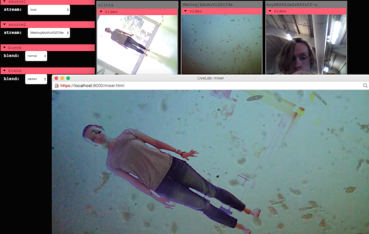
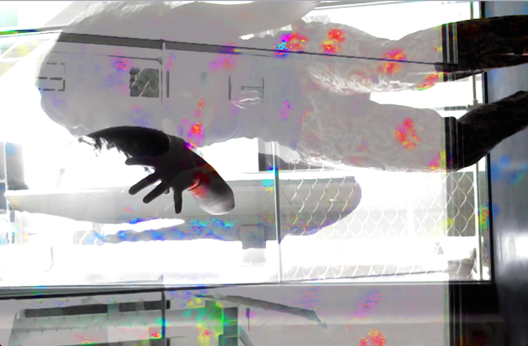
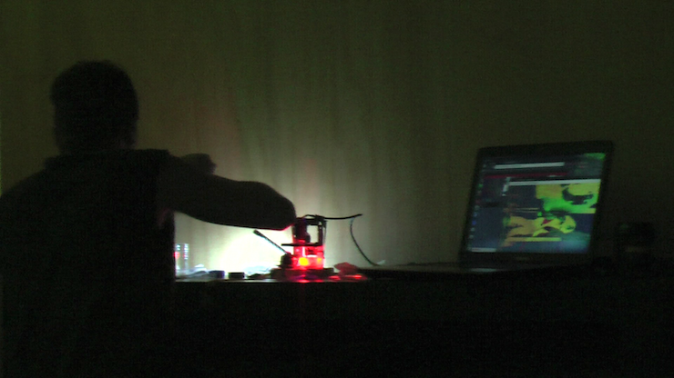

open source, browser-based toolkit for networked performance, that uses a peer-to-peer mesh network to share video, audio, and data streams between individuals and venues.

Supported by [CultureHub Art & Technology Center](http://www.culturehub.org/), La MaMa Experimental Theater Club, and Seoul Institute of the Arts. Project selected for [Interactivos? 16: Possible Worlds. Creative and Collaborative Uses of Digital Technology](http://medialab-prado.es/article/taller-interactivos-20162) at MediaLab-Prado in Madrid, June 2016.

<!-- [+ MORE INFO](http://livelabinteractivos.tumblr.com/) -->
[+ MORE INFO](https://www.culturehub.org/livelab)

[++ LIVE VERSION](https://livelab.app)

[+++ CODE](https://github.com/ojack/LiveLab)

