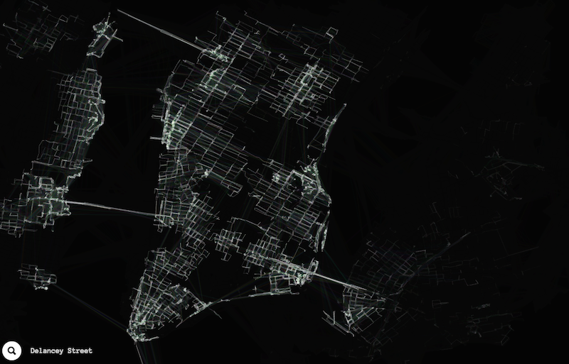
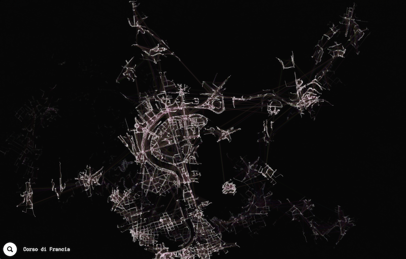
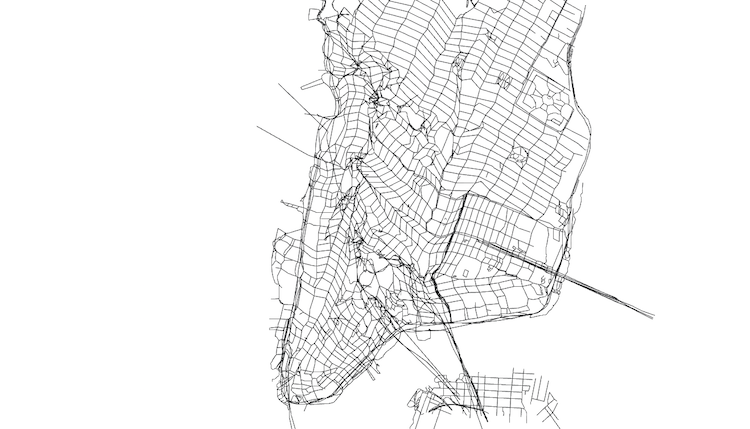
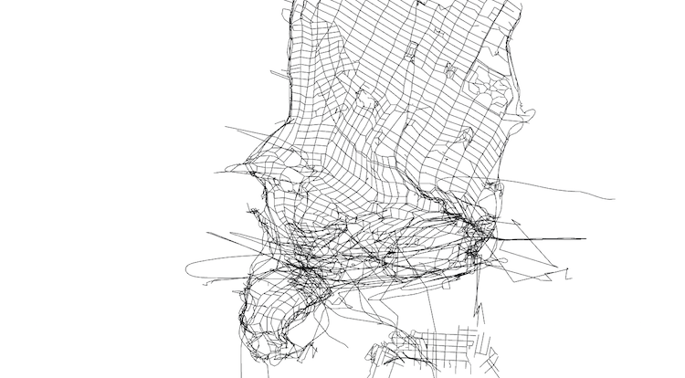
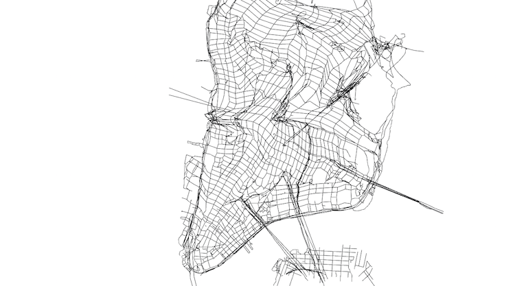

Generative and self-destructive streetmaps drawn into the browser.

## GHOST MAPS
[live](http://ojack.github.io/ghost-map) | [Code](https://github.com/ojack/ghost-map)

Featured on [Chrome Experiments](https://www.chromeexperiments.com/experiment/ghost-maps).

## ClOTH MAPS
[live](http://ojack.github.io/cloth-map/) | [Code](https://github.com/ojack/cloth-map)

