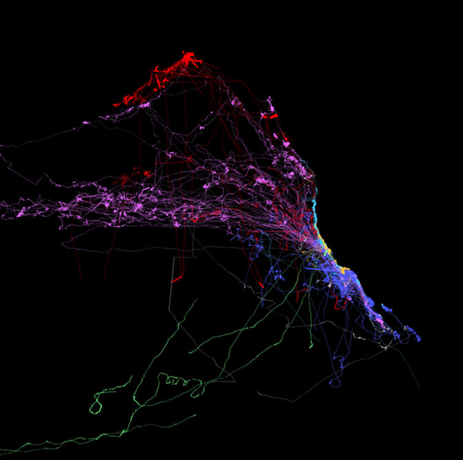
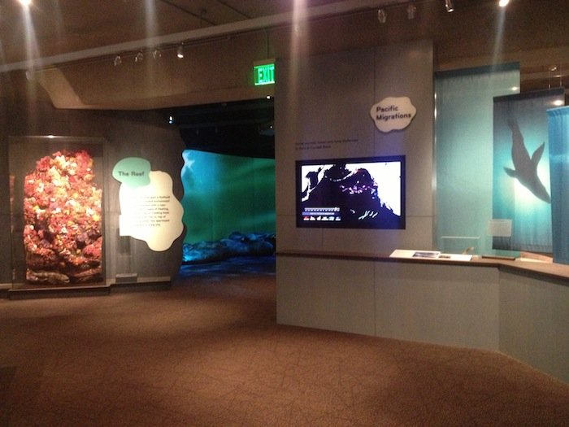
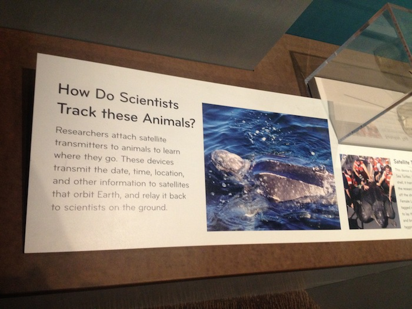
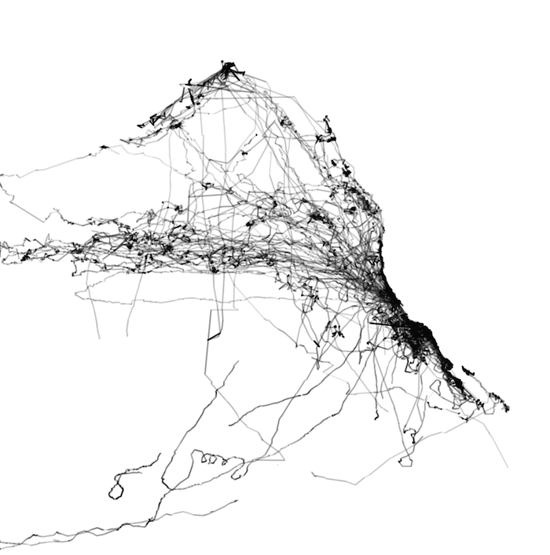

Data Visualization of Migration patterns of Pacific Predators, developed for the Gallery of California Natural Sciences at Oakland Museum of California.

<iframe src="//player.vimeo.com/video/70824261?title=0&amp;byline=0&amp;portrait=0&amp;color=ffffff&amp;autoplay=1&amp;loop=1" width="700" height="393" frameborder="0" webkitallowfullscreen mozallowfullscreen allowfullscreen></iframe>

Press: [SF Chronicle](http://www.sfgate.com/art/article/Oakland-Museum-of-Calif-Grand-reopening-4543144.php)

Data from [TOPP](http://www.topp.org/).

