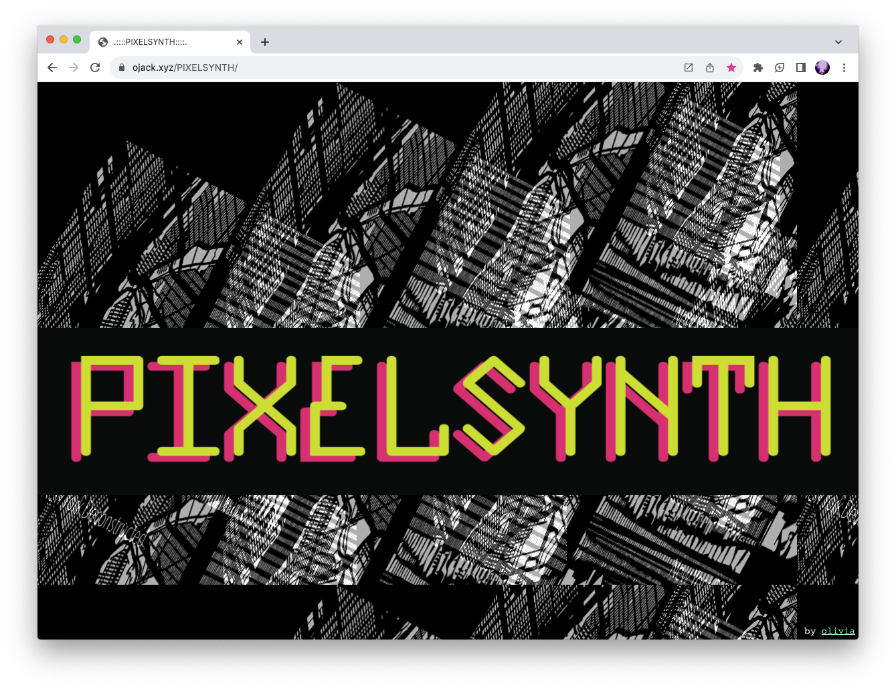
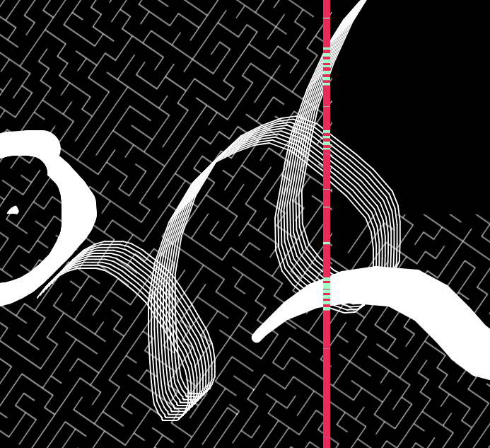
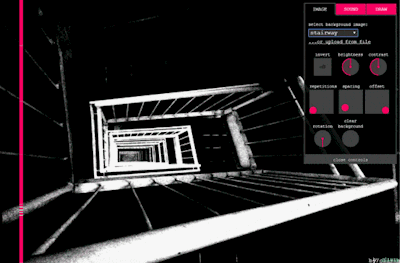
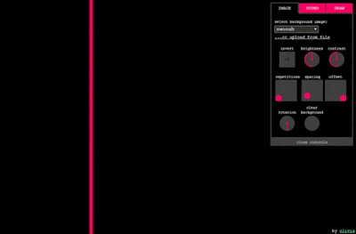

Browser-based synthesizer for creating sounds from images and drawings, programmed using javascript and Web Audio. [PIXELSYNTH](https://ojack.github.io/PIXELSYNTH) is inspired by the analog ANS Synthesizer created by Evgeny Murzin in 1937 for composing musical scores.  

[Live Version](https://ojack.github.io/PIXELSYNTH) | [Code](https://github.com/ojack/PIXELSYNTH)

### Press: 
* [Boing Boing](https://boingboing.net/2016/05/19/listen-to-your-images-with-pix.html)
* [Chrome Experiments](https://www.chromeexperiments.com/experiment/pixelsynth)
* [Prosthetic Knowledge](http://prostheticknowledge.tumblr.com/post/144825350966/pixelsynth-musical-webtoy-by-olivia-jack-reads)
* [KILL SCREEN](https://killscreen.com/articles/pixelsynth-composes-songs-pictures/)
* [FACT mag](http://www.factmag.com/2016/05/24/pixelsynth-browser-instrument-turns-images-into-music/)

<!-- ### In the wild -->
<!-- https://melbourne.sciencegallery.com/dark-matters-exhibits/muography -->
