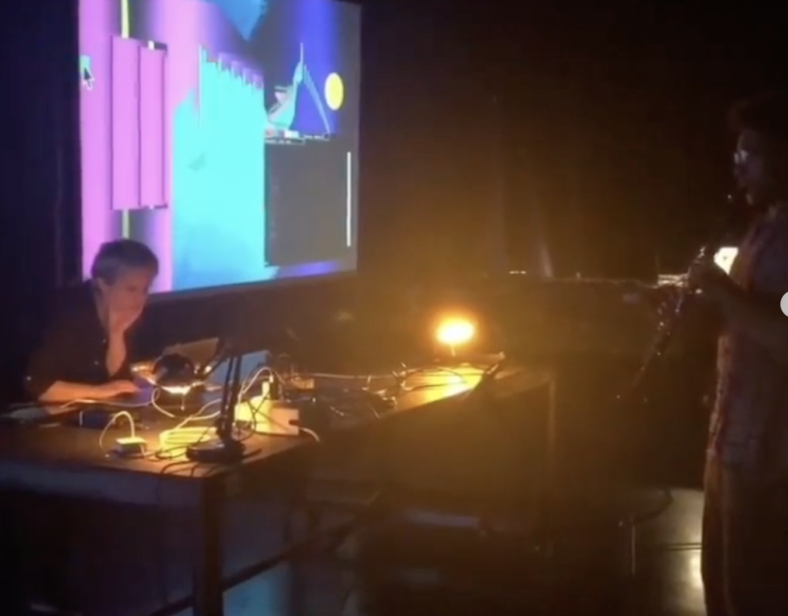

hangar.org, Barcelona, Spain (2022)
 Improvised collaboration with George Adje. Drawings create a live visual score for clarinet and control pitch and rhythm of looped audio.

Created using fubbles + hydra, clarinet, ipad looper, drawing pad.
https://hangar.org/en/audio-formal/57141/
 
    On May 13th at 6 pm Hangar presents the fifth session of Rarefacció, a listening cycle curated by Sergi Botella that aims to present proposals that revolve around music and sound from an experimental and unconventional point of view. The guests for this session are Helicotrema, Olivia Jack who will be joined by experimental musician George Adje, and Daniel Moreno Roldán in collaboration with Estel Boada.

