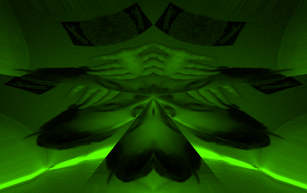
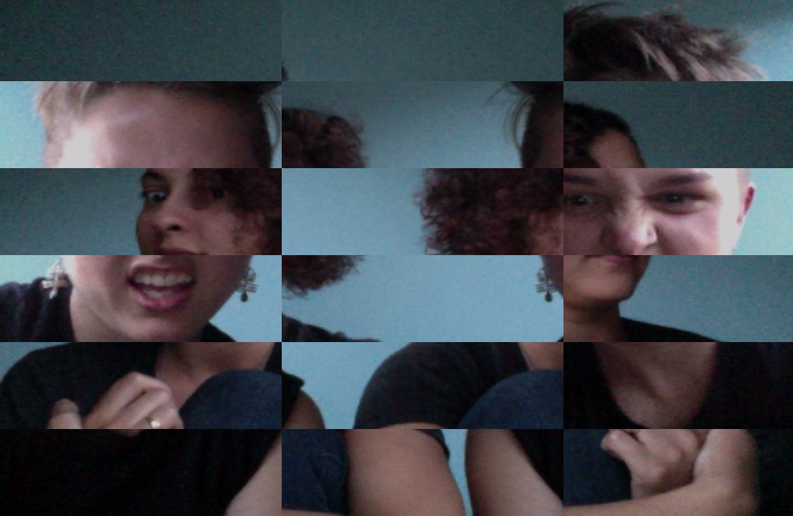
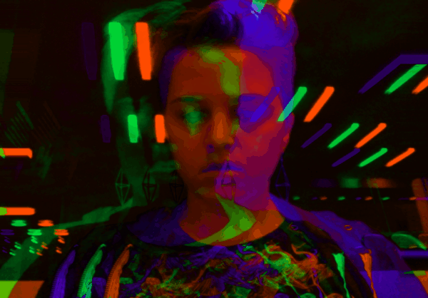
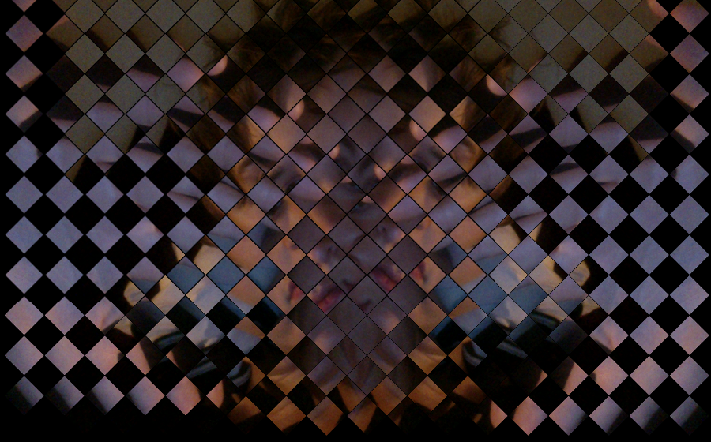
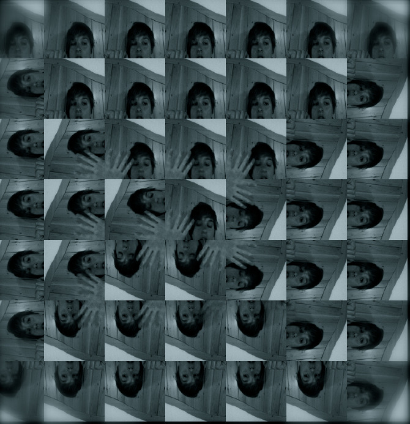

A set of experiments + gif generator, creating using javascript + webRTC and custom shaders in the browser.  
##[Live Version](https://ojack.github.io/selfie-apocalypse) (requires Chrome or Firefox and a webcam)
##[Code](https://github.com/ojack/selfie-apocalypse)

